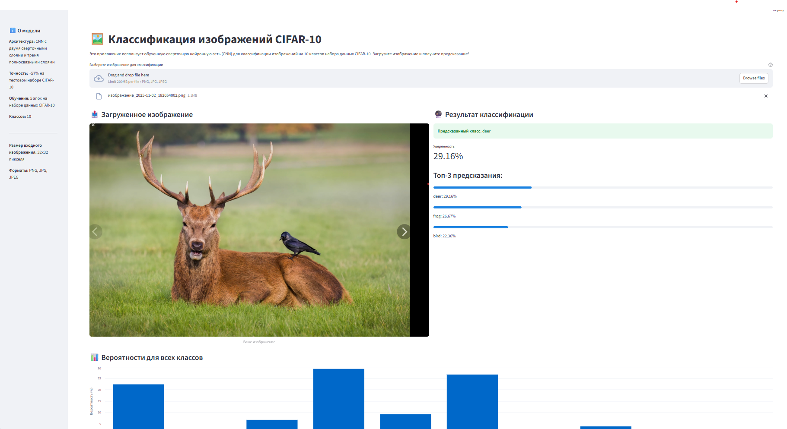

# Классификация изображений CIFAR-10

[](https://github.com/BeketML/cifar_project)

Проект по разработке интерактивного сервиса для классификации изображений из набора данных CIFAR-10 с использованием сверточных нейронных сетей (CNN) на PyTorch.

**Репозиторий**: [https://github.com/BeketML/cifar_project](https://github.com/BeketML/cifar_project)

## Описание проекта

Этот проект представляет собой end-to-end решение для классификации изображений. Он включает:

- **Аналитическую часть**: Jupyter notebook с обучением сверточной нейронной сети (CNN) на PyTorch
- **Интерактивную часть**: Веб-приложение на Streamlit для классификации загруженных пользователем изображений

**Цель проекта**: Продемонстрировать процесс создания системы классификации изображений от обучения модели до развертывания в виде рабочего веб-приложения.

## Структура проекта

```
cifar/
├── data/                          # Данные CIFAR-10 (не включено в репозиторий)
├── images/
│   └── interface.png             # Скриншот интерфейса Streamlit приложения
├── cifar.ipynb                    # Jupyter notebook с обучением модели
├── cifar_net.pth                  # Сохраненная обученная модель
├── streamlit_app.py               # Streamlit веб-приложение
├── requirements.txt               # Зависимости проекта
├── README.md                      # Этот файл
└── .gitignore                    # Git ignore файл
```

## Набор данных

- **Источник**: CIFAR-10 Dataset
- **Описание**: 60,000 цветных изображений размером 32x32 пикселя в 10 классах (6,000 изображений на класс)
- **Классы**: `plane`, `car`, `bird`, `cat`, `deer`, `dog`, `frog`, `horse`, `ship`, `truck`

## Технологии

- **Python 3.x**
- **PyTorch** - фреймворк для глубокого обучения
- **TorchVision** - библиотека для работы с изображениями и датасетами
- **Streamlit** - веб-фреймворк для создания интерактивных приложений
- **PIL (Pillow)** - обработка изображений
- **NumPy, Pandas** - обработка данных

## Установка и настройка

### 1. Клонирование репозитория

```bash
git clone https://github.com/BeketML/cifar_project.git
cd cifar_project
```

### 2. Создание виртуального окружения

**Windows:**
```bash
python -m venv venv
venv\Scripts\activate
```

**Linux/Mac:**
```bash
python3 -m venv venv
source venv/bin/activate
```

### 3. Установка зависимостей

```bash
pip install -r requirements.txt
```

**Примечание**: Для установки PyTorch может потребоваться дополнительная настройка в зависимости от вашей системы (CPU/GPU). Проверьте [официальный сайт PyTorch](https://pytorch.org/get-started/locally/) для правильной установки.

## Запуск приложения

### Запуск Streamlit приложения

```bash
streamlit run streamlit_app.py
```

Приложение откроется в браузере по адресу `http://localhost:8501`

### Запуск Jupyter notebook

```bash
jupyter notebook cifar.ipynb
```

## Пример работы приложения

Ниже представлен скриншот интерфейса Streamlit приложения для классификации изображений CIFAR-10.



На скриншоте видно:
- **Интерфейс загрузки изображения**: Пользователь может выбрать файл для классификации
- **Отображение результата**: После загрузки изображения приложение показывает предсказанный класс и уверенность модели
- **Визуализация вероятностей**: Графики и таблицы с вероятностями для всех 10 классов CIFAR-10

## Использование

### Streamlit приложение

1. Откройте приложение в браузере после запуска команды `streamlit run streamlit_app.py`
2. Нажмите "Browse files" или перетащите изображение в область загрузки
3. Поддерживаемые форматы: PNG, JPG, JPEG
4. Приложение автоматически:
   - Изменит размер изображения до 32x32 пикселей
   - Применит необходимые трансформации
   - Выполнит классификацию
   - Покажет предсказанный класс и вероятности для всех классов

### Jupyter notebook

Notebook содержит полный цикл работы с данными:

1. Загрузка данных CIFAR-10
2. Визуализация примеров изображений
3. Определение архитектуры CNN
4. Обучение модели
5. Оценка производительности на тестовом наборе
6. Сохранение модели

## Информация о модели

### Архитектура CNN

Модель состоит из следующих слоев:

- **Conv2d(3, 6, 5)** - первый сверточный слой
- **MaxPool2d(2, 2)** - слой пулинга
- **Conv2d(6, 16, 5)** - второй сверточный слой
- **MaxPool2d(2, 2)** - слой пулинга
- **Linear(16 * 5 * 5, 120)** - первый полносвязный слой
- **Linear(120, 84)** - второй полносвязный слой
- **Linear(84, 10)** - выходной слой (10 классов)

### Производительность

- **Точность на тестовом наборе**: ~57%
- **Количество эпох обучения**: 5
- **Оптимизатор**: Adam (learning rate = 0.001)
- **Функция потерь**: CrossEntropyLoss

### Точность по классам

- plane: 69%
- car: 69%
- bird: 53%
- cat: 30%
- deer: 43%
- dog: 57%
- frog: 72%
- horse: 58%
- ship: 65%
- truck: 59%

**Примечание**: Модель показывает лучшие результаты для объектов с четкими формами (frog, plane, car) и хуже для животных с похожими характеристиками (cat, deer).

## Ограничения

- Модель обучена на маленьких изображениях (32x32 пикселя)
- Точность ~57% - базовая модель для демонстрации концепции
- Для улучшения результатов можно использовать более глубокие архитектуры (ResNet, VGG и т.д.)

## Будущие улучшения

- Использование более глубоких архитектур (ResNet, VGG, DenseNet)
- Data augmentation для увеличения разнообразия обучающих данных
- Fine-tuning предобученных моделей
- Улучшение точности через большее количество эпох обучения
- Добавление возможности загрузки собственной модели

## Авторы

Проект разработан в рамках изучения глубокого обучения и развертывания моделей.

## Лицензия

Этот проект создан в образовательных целях.

## Ресурсы

- [CIFAR-10 Dataset](https://www.cs.toronto.edu/~kriz/cifar.html)
- [PyTorch Documentation](https://pytorch.org/docs/stable/index.html)
- [Streamlit Documentation](https://docs.streamlit.io/)

